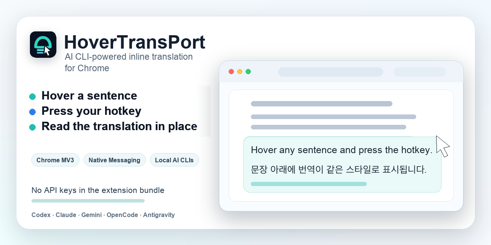

# HoverTransPort

Language: English | [한국어](readmes/README.ko.md)



HoverTransPort is a Chrome Manifest V3 extension that translates selected or hovered web text on demand and renders the result inline. Hover a sentence, press your trigger hotkey, and read the translation in the page instead of switching to a separate translation tab.

It uses Chrome Native Messaging to call a local helper. The helper invokes the AI CLI that is already installed and authenticated on your machine: Codex CLI, Claude CLI, Gemini CLI, OpenCode CLI, or Antigravity CLI.

This project is not affiliated with, endorsed by, or sponsored by OpenAI, Codex, Anthropic, Claude, Google, Gemini, OpenCode, or Antigravity.

## What It Does

| Flow | Result |
| --- | --- |
| Hover a readable paragraph, list item, or heading | Translate the hovered block inline |
| Select specific text | Translate the selection first |
| Press a configured hotkey | Run translation only when requested |
| Use a local AI CLI provider | Keep provider auth outside the extension bundle |

## Quick Start

1. Download `hover-trans-port-extension-v<version>.zip` from the [latest GitHub Release](https://github.com/monk-lee/hover-trans-port/releases/latest).
2. Unzip it, open `chrome://extensions`, enable Developer mode, and load the unzipped folder.
3. Install the macOS native host:

   ```bash
   curl -fsSL https://github.com/monk-lee/hover-trans-port/releases/latest/download/install-macos-native-host.sh | bash
   ```

4. Open the extension Options page and run `Check Native Host` and `Check Provider`.
5. Choose a provider, target language, and trigger hotkey.

Each provider CLI is a separate prerequisite. Install and authenticate Codex CLI, Claude CLI, Gemini CLI, OpenCode CLI, or Antigravity CLI before selecting it in Options.

For update, uninstall, inspect-first install, diagnostics, and troubleshooting details, see [Native Host Install](docs/native-host-install.md).

## Use

1. Open a normal page with readable text.
2. Select text, or hover a paragraph, list item, or heading.
3. Press the configured trigger hotkey. The default is pressing and releasing left Control by itself.
4. Wait for the inline translation.

Common browser and editing shortcuts such as Ctrl+C or Ctrl+F are blocked from trigger recording.

## Current Scope

| Works today | Not yet |
| --- | --- |
| macOS and Google Chrome | Chrome Web Store install |
| Unpacked extension loaded from `dist/` | Windows/Linux native host guide |
| Codex, Claude, Gemini, OpenCode, and Antigravity CLI providers | Full-page automatic translation |
| Hovered readable block and selection translation | PDF, iframe, OCR, or subtitle translation |
| Inline rendering, local SQLite cache, and Options diagnostics | Hosted translation service |

## Privacy At A Glance

HoverTransPort is local-first, but not offline-only. Requested text is passed to the local helper, which invokes the configured provider CLI. That provider CLI may send requested text upstream according to your account, authentication, environment, and provider policies.

The extension and helper do not store API keys, OAuth tokens, browser cookies, or service session tokens. If cache is enabled, normalized source text and translated text can be stored in local plaintext SQLite.

Read [PRIVACY.md](PRIVACY.md) and [SECURITY.md](SECURITY.md) before using HoverTransPort on sensitive content.

## Build From Source

```bash
pnpm install
pnpm build
```

Load this repository's `dist/` folder from `chrome://extensions`.

For development:

```bash
pnpm install
pnpm verify
pnpm dev
```

Developer native-host install from source:

```bash
pnpm helper:build:release
pnpm native:install
```

## Project Docs

- [Native Host Install](docs/native-host-install.md)
- [Privacy](PRIVACY.md)
- [Security](SECURITY.md)
- [Contributing](CONTRIBUTING.md)

## License

MIT. See [LICENSE](LICENSE).
