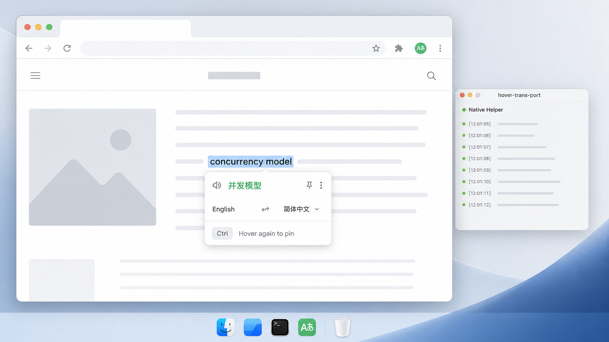

# HoverTransPort

언어: [English](../README.md) | 한국어

> 이 한국어 README는 빠른 이해를 위한 요약입니다. 릴리스, 보안, 개인정보, Native Host 세부 기준은 영어 원문 문서를 우선합니다.



HoverTransPort는 웹페이지에서 텍스트를 선택하거나 마우스를 올린 뒤 지정한 단축키를 누르면 원문 근처에 번역을 보여주는 Chrome 확장 프로그램입니다. Chrome Native Messaging으로 로컬 helper를 호출하고, helper는 사용자가 이미 설치하고 로그인한 Codex CLI, Claude CLI, 또는 Gemini CLI를 실행합니다.

이 프로젝트는 OpenAI, Codex, Anthropic, Claude, Google, Gemini와 제휴, 보증, 후원을 받는 공식 제품이 아닙니다.

## 현재 범위

현재 동작하는 범위:

- macOS, Google Chrome, `dist/` 폴더를 직접 불러오는 unpacked extension 설치.
- Codex CLI provider, Claude CLI provider 및 Gemini CLI provider.
- 선택 영역 우선 번역과 마우스로 가리킨 읽기 가능한 블록 번역.
- 원문 안에 번역 표시, 로컬 SQLite 캐시, Options 진단 기능.
- macOS native host용 script installer.

아직 지원하지 않는 범위:

- Chrome Web Store 설치.
- Windows/Linux Native Host 설치 가이드.
- 전체 페이지, 자동, PDF, iframe, OCR, 자막 번역.

## 설치

### 1. Release에서 Extension package 다운로드

[최신 GitHub Release](https://github.com/monk-lee/hover-trans-port/releases/latest)를 열고 `hover-trans-port-extension-v<version>.zip` asset을 다운로드합니다. 예: `hover-trans-port-extension-v0.2.8.zip`.

압축을 해제한 뒤 `chrome://extensions`를 열고 Developer mode를 켠 다음 `Load unpacked`에서 압축 해제한 extension 폴더를 선택합니다. Chrome은 `.zip` 파일 자체가 아니라 압축 해제한 폴더를 불러옵니다.

### 2. macOS Native Host 설치

macOS 설치 경로는 GitHub Releases의 prebuilt native host를 `curl`로 설치하는 방식입니다.

```bash
curl -fsSL https://github.com/monk-lee/hover-trans-port/releases/latest/download/install-macos-native-host.sh | bash
```

이 installer는 현재 Mac 아키텍처에 맞는 helper를 다운로드하고 `checksums.txt`로 검증한 뒤, stable launcher와 Chrome Native Messaging manifest를 등록합니다. Codex CLI, Claude CLI, Gemini CLI는 별도 전제 조건이므로 Options에서 선택하기 전에 각 로컬 CLI가 설치되고 인증되어 있어야 합니다.

아직 스스로 업데이트할 수 없는 오래된 native host를 쓰고 있으면 extension의 Popup 또는 Options에 수동 업데이트 안내가 표시됩니다. 같은 `curl` 명령을 한 번 실행한 뒤 extension을 다시 불러오면, 이후 update-capable host는 Options에서 업데이트할 수 있습니다.

스크립트를 먼저 확인하고 실행하려면:

```bash
curl -fLO https://github.com/monk-lee/hover-trans-port/releases/latest/download/install-macos-native-host.sh
bash install-macos-native-host.sh install
```

자주 쓰는 명령:

```bash
bash install-macos-native-host.sh status
bash install-macos-native-host.sh update
bash install-macos-native-host.sh uninstall
```

### 3. 설치 상태 확인

Extension의 Options 페이지를 열고 `Check Native Host`와 `Check Provider`를 모두 실행합니다.

Options는 선택한 provider의 model catalog를 native host에 요청합니다. Codex는 `codex debug models`로 CLI가 제공하는 모델 목록을 보여줄 수 있고, 안정적인 machine-readable 목록 명령이 없는 provider는 내장 fallback alias를 사용하되 custom model 값은 계속 허용합니다.

### Source에서 Extension build하기

release package를 다운로드하지 않고 로컬에서 unpacked extension을 build하려면:

```bash
pnpm install
pnpm build
```

이후 `chrome://extensions`를 열고 Developer mode를 켠 다음 `Load unpacked`에서 이 저장소의 `dist/` 폴더를 선택합니다.

개발자가 source에서 native host를 설치할 수도 있습니다.

```bash
pnpm helper:build:release
pnpm native:install
```

Native host 설치와 문제 해결의 상세 기준은 영어 문서 [Native Host Install](../docs/native-host-install.md)을 참고하세요.

## 사용

1. 읽기 가능한 텍스트가 있는 일반 웹페이지를 엽니다.
2. 텍스트를 선택하거나 문단, 목록, 제목 위에 마우스를 올립니다.
3. 필요하면 Options에서 `Target language`와 `Trigger hotkey`를 설정합니다.
4. 설정한 trigger hotkey를 누릅니다. 기본값은 왼쪽 Control 키만 눌렀다가 떼는 방식입니다.
5. 페이지 안에 번역이 표시될 때까지 기다립니다.

Ctrl+C 또는 Ctrl+F 같은 일반 브라우저/편집 단축키는 trigger로 저장되지 않습니다.

## 개인정보와 보안 요약

HoverTransPort는 로컬 중심으로 동작하지만 완전한 오프라인 번역기는 아닙니다. 번역 요청 텍스트는 로컬 helper를 거쳐 설정된 provider CLI로 전달되며, 사용자의 CLI 계정, 로그인 상태, 실행 환경, 제공자 정책에 따라 외부 AI 서비스로 전송될 수 있습니다.

확장 프로그램과 helper는 API 키, OAuth 토큰, 브라우저 쿠키, 서비스 세션 토큰을 저장하지 않습니다. 캐시가 활성화되어 있으면 정규화된 원문과 번역문이 암호화되지 않은 로컬 SQLite에 저장될 수 있습니다.

민감하거나 기밀인 콘텐츠에 사용하기 전에 영어 원문 [PRIVACY.md](../PRIVACY.md)와 [SECURITY.md](../SECURITY.md)를 읽어 주세요.

## 개발

```bash
pnpm install
pnpm verify
pnpm dev
```

유용한 scripts:

- `pnpm build`: extension을 `dist/`에 build합니다.
- `pnpm verify`: 프로젝트 검증을 실행합니다.
- `pnpm helper:build:release`: 컴파일된 Native Messaging helper를 build합니다.
- `pnpm native:install`: 컴파일된 helper용 macOS Chrome Native Messaging manifest를 설치합니다.
- `pnpm native:uninstall`: native host manifest와 launcher를 제거합니다.
- `pnpm macos:script-installer:build`: macOS script installer release assets를 build합니다.

기여 전에는 영어 원문 [CONTRIBUTING.md](../CONTRIBUTING.md)를 참고하세요.

## 라이선스

MIT. [LICENSE](../LICENSE)를 참고하세요.
